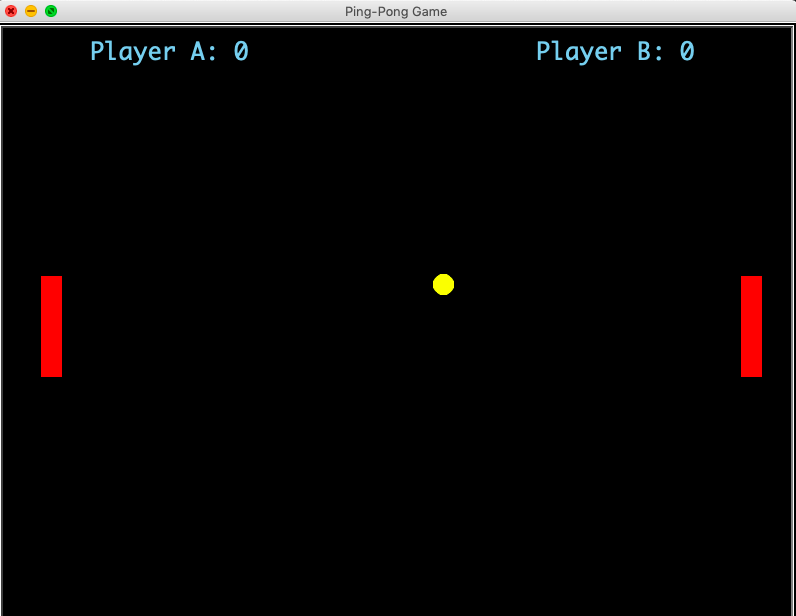

# PING PONG GAME

It is multiplayer ping pong game build on turtle module. where two persons can play this game.you can simply run the file to play the game by downloading all the files that are necessary to the game.you need to download music effects also to get good experience with the game.

### Game Start Window

## Controls

### Arrow Keys for Direction:

#### For Player A:

	To move paddle up press 'u'
	To move paddle down press 'e'

### For Player B:

	To move paddle up press 'UP_ARROW'
	To move paddle down press 'DOWN_ARROW'

## Dependencies:

1. Python v3.x is required.
2. turtle module is also required.

## Disclaimer:

This project is Open Source licensed.
